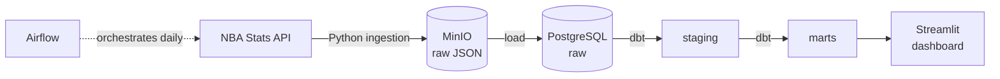

# 🏀 Triple Double

**An automated data pipeline that ingests NBA game data daily, models it in a tested data warehouse, and serves insights through an interactive dashboard.**


---

## Overview

Triple Double collects box scores, player stats, and play-by-play data after every NBA game day, transforms it into analysis-ready tables, and powers a dashboard for exploring player form, team trends, and standings.

The project is built around production data engineering practices: incremental loading, idempotent runs, automated data quality tests, and one-command local deployment.


## Architecture



An Airflow DAG runs every morning to:

1. Fetch the previous day's games, box scores, and play-by-play
2. Store raw API responses in object storage, partitioned by date
3. Load only new records into PostgreSQL
4. Run dbt models and data quality tests
5. Refresh the tables behind the dashboard

## Tech Stack

| Layer | Technology |
|---|---|
| Ingestion | Python, `nba_api` |
| Raw storage | MinIO (S3-compatible) |
| Warehouse | PostgreSQL |
| Transformation & testing | dbt Core |
| Orchestration | Apache Airflow |
| Dashboard | Streamlit |
| Infrastructure | Docker, docker-compose |
| CI | GitHub Actions |

## Key Features

- **Incremental loads:** only new games are fetched and loaded
- **Idempotent pipeline:** re-running any day never creates duplicates
- **Backfills:** load any past date range or season with a single command
- **Resilient ingestion:** retries, rate limiting, and cached raw responses
- **Data quality tests:** uniqueness, not-null, and referential integrity checks on every run
- **Documented lineage:** auto-generated dbt docs show how every table is built

## Data Model

| Layer | Tables |
|---|---|
| **Staging** | `stg_games`, `stg_players`, `stg_teams`, `stg_box_scores`, `stg_play_by_play` |
| **Facts** | `fct_player_game_stats`, `fct_team_game_stats` |
| **Dimensions** | `dim_players`, `dim_teams`, `dim_dates` |
| **Analytics** | `player_rolling_form`, `team_standings` |

## Getting Started

**Prerequisites:** Docker and Docker Compose

```bash
git clone https://github.com/your-username/triple-double.git
cd triple-double
docker-compose up -d
```

| Service | URL |
|---|---|
| Airflow | http://localhost:8080 |
| Dashboard | http://localhost:8501 |

Backfill a past season:

```bash
docker-compose exec airflow airflow dags backfill nba_daily -s 2025-10-21 -e 2026-04-12
```

## Project Structure

```
triple-double/
├── ingestion/          # API extraction and loading scripts
├── dags/               # Airflow DAGs
├── dbt/                # dbt models, tests, and docs
│   └── models/
│       ├── staging/
│       └── marts/
├── dashboard/          # Streamlit app
├── .github/workflows/  # CI pipeline
└── docker-compose.yml
```

## Future Work

- Game outcome prediction model with MLflow experiment tracking
- Prediction API built with FastAPI
- Natural-language questions over the warehouse using an LLM
- Cloud deployment on AWS S3 and BigQuery
